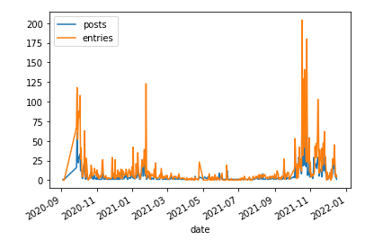

# roam-data

Code to read and analyse data exported from [Roam](https://roamresearch.com/) in `json` format

Here's a plot showing hom many posts I made in my main Roam graph for each day, and how many entries there were on 
that date.

